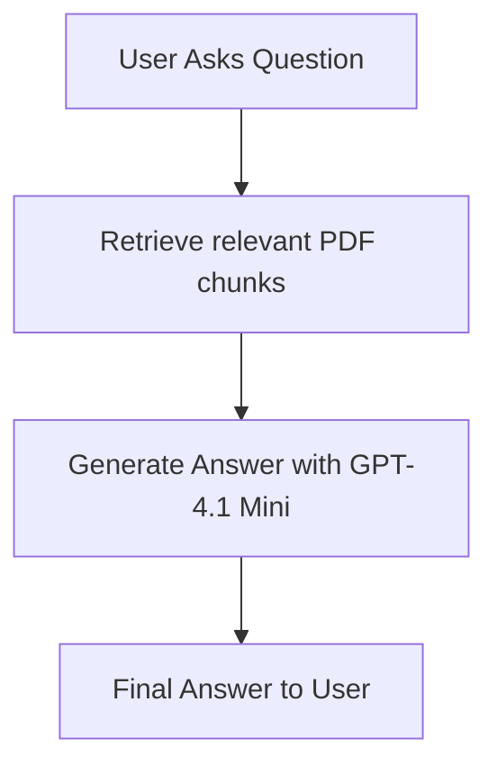

# 📄 PDF RAG – Ask Your PDFs Anything, Securely

> 🔗 Originally shared on [X by Aniruddh Nagare](https://x.com/AniruddhNagare/status/1933967594094219269)

**PDF RAG** is an AI-driven web application that lets users upload PDF documents and ask questions about their content, receiving context-aware answers powered by **GPT-4.1 Mini** from OpenAI.

This tool is built using **Next.js**, **Express.js**, and deployed securely on **AWS EC2**. It’s a practical showcase of Retrieval-Augmented Generation (RAG) architecture, helping users extract meaningful insights from documents in real time.

---

## 🚀 Tech Stack

- **Frontend**: Next.js
- **Backend**: Express.js + Node.js
- **AI Engine**: OpenAI GPT-4.1 Mini (RAG)
- **Storage**: PDF-to-Vector DB processing
- **Security**: Authenticated sessions, secure file handling
- **Deployment**: AWS EC2 (Ubuntu + PM2)

---

## 🔐 PDF RAG Security Explained

To protect sensitive documents and interactions, PDF RAG implements:

- ✅ **User Authentication** Clerk Authentication
- 🔐 **Encrypted PDF Uploads** stored temporarily in quadrantDB
- 🧠 **Scoped Vector Search** limited to user-uploaded PDFs
- 🧾 **Read-only Querying** (no document alteration)
- 📦 **No persistent storage unless opted in**

These security decisions help build user trust, especially when dealing with confidential documents like legal contracts or internal reports.

---

## 🧠 What is RAG (Retrieval-Augmented Generation)?

**RAG** is an architecture that combines document retrieval and language generation. Instead of relying solely on a language model’s internal knowledge, RAG first retrieves relevant context from a database (in this case, the PDF’s content turned into embeddings), then uses the model to generate a focused answer.



---

## ⚖️ RAG in Legal Research

PDF RAG is particularly impactful in **legal research**, where:

- 📚 Case laws and contracts are complex and lengthy
- 🔍 Precision and relevance matter
- 🧾 Regulations evolve frequently

By allowing lawyers and paralegals to *ask questions* like:

> "What are the termination clauses in this contract?"

...and get contextual answers instantly, RAG systems **save hours of manual reading**.

> 📖 Research from [arXiv:2311.15667](https://arxiv.org/abs/2311.15667) and others suggest RAG improves factual accuracy, reduces hallucinations, and supports explainability in AI responses.

---

## 🛠️ Sample Code Snippet: PDF Upload API

```ts
// Express route for uploading and vectorizing a PDF
app.post("/upload", authenticateUser, upload.single("file"), async (req, res) => {
  const pdfBuffer = req.file.buffer;
  const chunks = splitPDFIntoChunks(pdfBuffer);
  const embeddings = await generateEmbeddings(chunks);
  saveToVectorDB(req.user.id, embeddings);
  res.json({ message: "PDF processed successfully." });
});
```

---

## 📈 Trends & Future Scope

- ✅ Integrating RAG into enterprise search tools
- 📊 LegalTech, HR, Finance use cases
- 🤝 Hybrid AI + human-in-the-loop systems
- 🧠 Enhancing context tracking with multi-document memory

---

## 🤖 Final Thoughts

PDF RAG empowers users to converse with complex documents — securely and intelligently.

> Whether it's legal contracts, technical manuals, or policy documents — AI + RAG can help you **find what matters, faster**.

Want to build something similar or customize it for your team? Connect with me on [X](https://x.com/AniruddhNagare).
